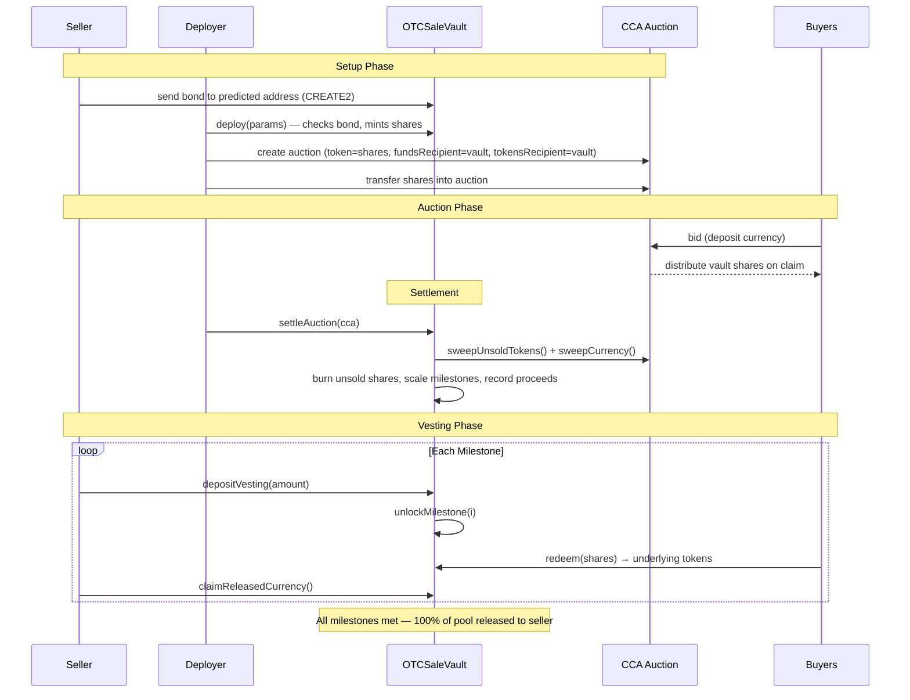
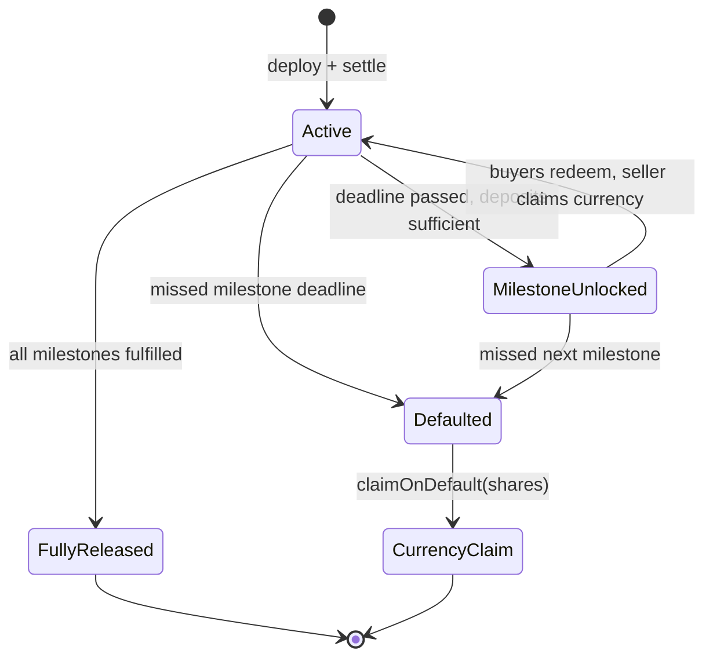

# OTC Sale Vault

ERC4626 vault for trustless OTC token sales via [Uniswap CCA](https://github.com/Uniswap/twap-auction). Replaces intermediary escrow with a smart contract that enforces vesting schedules, milestone-gated redemption, and a seller bond backed by escrowed auction proceeds.

## How It Works

The vault is deployed as an ERC20 that serves as the `auctionToken` in a CCA auction. Shares are pre-minted to the deployer, who transfers them into the CCA. Buyers receive shares through the auction. The vault starts empty — the seller deposits underlying tokens over time per a predefined milestone schedule. Buyers redeem shares for underlying tokens as milestones unlock.

The vault holds a **unified currency pool** (seller bond + auction proceeds) in a single ERC20 token (e.g. USDC). As the seller completes milestones, a proportional share of the entire pool is released to them. If the seller misses a milestone deadline, anyone can trigger default, and share holders claim the remaining locked currency pro-rata.

## Architecture

```
src/
├── OTCSaleVault.sol              # Core vault (ERC4626 + currency escrow + milestones)
└── interfaces/
    ├── IOTCSaleVault.sol         # Interface, structs, errors, events
    └── ICCA.sol                  # Minimal CCA interface for sweep calls
```

## Vault + CCA Lifecycle



## Default + Recovery Flow



## Key Accounting Details

| Concern | Mechanism |
|---|---|
| Unified currency pool | `BOND_AMOUNT + $totalAuctionProceeds` — bond and proceeds treated as one pool |
| Proportional release | After milestone *i*: `pool × milestone[i].cumAmount / milestone[last].cumAmount` released to seller |
| Bond at construction | Constructor checks `balanceOf(address(this)) >= bondAmount` — no separate `postBond()` |
| Redemption tracking | Explicit `$totalAssetsWithdrawn` counter (immune to donation attacks) |
| Default claim denominator | `$defaultCirculatingSupply` snapshot at time of default (no stranded funds) |
| Unsold shares | `settleAuction()` burns them, scales milestone obligations proportionally |
| Currency-only default | `claimOnDefault()` distributes locked currency; deposited underlying stays in vault |
| Donation resistance | Accounting uses explicit counters, not balance checks — extra tokens sent to vault have no effect |

## Deploy

The bond must be at the vault address before deployment. Use CREATE2 to predict the address.

```bash
# Set environment variables
export UNDERLYING_TOKEN=0x...
export SELLER=0x...
export TOTAL_SHARES=1000000000000000000000000
export CURRENCY=0x...
export BOND_AMOUNT=100000000000
export MILESTONE_DEADLINES=1700100000,1700200000,1700300000
export MILESTONE_AMOUNTS=250000000000000000000000,500000000000000000000000,1000000000000000000000000

forge script script/Deploy.s.sol --rpc-url $RPC_URL --broadcast
```

Shares are minted to the deployer. Next steps after deploy:
1. Transfer vault shares to the CCA auction contract (vault must be set as both `fundsRecipient` and `tokensRecipient`)
2. After auction ends, call `settleAuction(ccaAddress)` on the vault

## Build & Test

```bash
forge build
forge test
```
