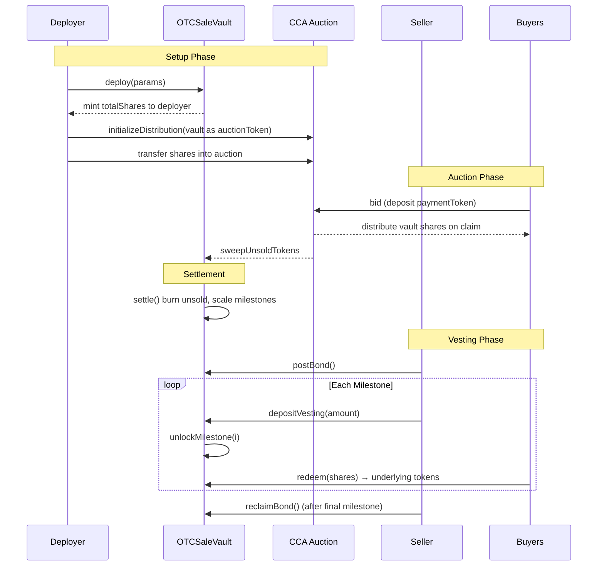
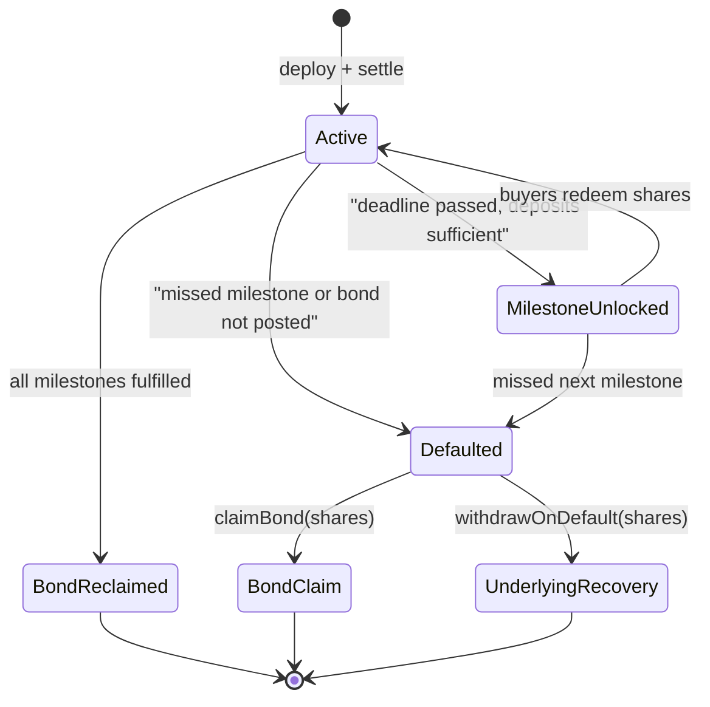

# OTC Sale Vault

ERC4626 vault for trustless OTC token sales via [Uniswap CCA](https://github.com/Uniswap/twap-auction). Replaces intermediary escrow with a smart contract that enforces vesting schedules, milestone-gated redemption, and a seller bond.

## How It Works

The vault is deployed as an ERC20 that serves as the `auctionToken` in a CCA auction. Shares are pre-minted to the deployer, who transfers them into the CCA. Buyers receive shares through the auction. The vault starts empty — the seller deposits underlying tokens over time per a predefined milestone schedule. Buyers redeem shares for underlying tokens as milestones unlock.

A configurable bond (in any ERC20) protects buyers: if the seller misses a milestone deadline, anyone can trigger default, and share holders claim the bond pro-rata.

## Architecture

```
src/
├── OTCSaleVault.sol              # Core vault (ERC4626 + bond + milestones)
└── interfaces/
    └── IOTCSaleVault.sol         # Interface, structs, errors, events
```

## Vault + CCA Lifecycle



## Default + Recovery Flow



## Key Accounting Details

| Concern | Mechanism |
|---|---|
| Redemption tracking | Explicit `$totalAssetsWithdrawn` counter (immune to donation attacks) |
| Bond payout denominator | `$defaultCirculatingSupply` snapshot at time of default (no stranded funds) |
| Unsold shares | `settle()` burns them, scales milestone obligations proportionally |
| Post-default underlying | `withdrawOnDefault()` lets holders recover already-deposited tokens |
| Bond + underlying | Holders can do both — use some shares for bond, others for underlying |

## Deploy

```bash
# Set environment variables
export UNDERLYING_TOKEN=0x...
export SELLER=0x...
export TOTAL_SHARES=1000000000000000000000000
export BOND_TOKEN=0x...
export BOND_AMOUNT=100000000000
export BOND_DEADLINE=1700000000
export MILESTONE_DEADLINES=1700100000,1700200000,1700300000
export MILESTONE_AMOUNTS=250000000000000000000000,500000000000000000000000,1000000000000000000000000

forge script script/Deploy.s.sol --rpc-url $RPC_URL --broadcast
```

Shares are minted to the deployer. Next steps after deploy:
1. Approve vault shares to the CCA auction contract
2. Call `initializeDistribution` on the CCA with the vault as `auctionToken`

## Build & Test

```bash
forge build
forge test
```
